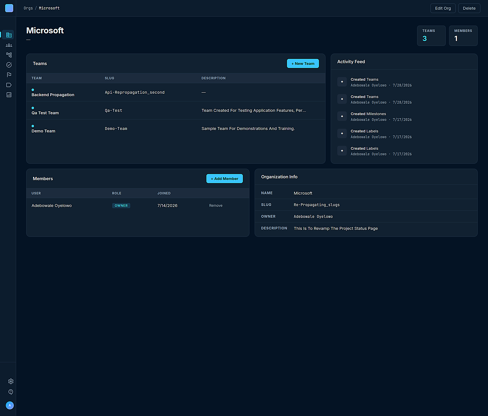
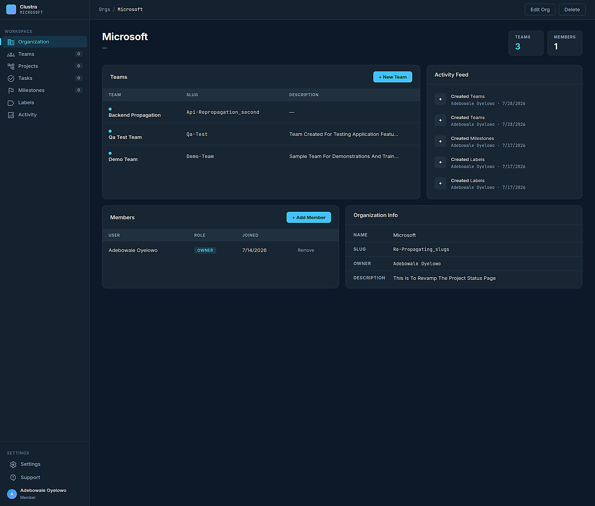
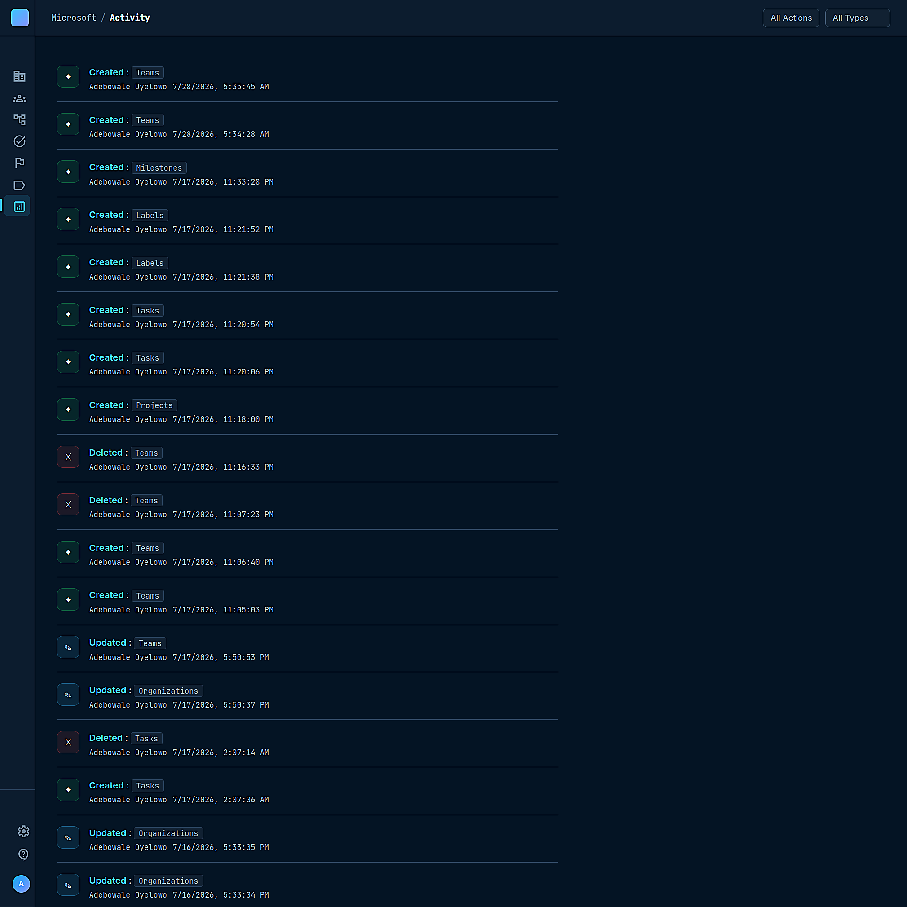

# Clustra

> Multi-tenant project management API and frontend built with FastAPI, PostgreSQL, async SQLAlchemy, and role-based access control. The frontend is vanilla JavaScript with ES Modules — no framework, no component library, no build step.

## Table of Contents

- [What It Is](#what-it-is)
- [Screenshots](#screenshots)
- [Hierarchy](#hierarchy)
- [Stack](#stack)
- [Backend Architecture](#backend-architecture)
- [Auth](#auth)
- [Roles and Permissions](#roles-and-permissions)
- [Membership](#membership)
- [Tenant Isolation](#tenant-isolation)
- [Activity Logging](#activity-logging)
- [Cascade Deletes](#cascade-deletes)
- [Frontend Architecture](#frontend-architecture)
- [Sidebar](#sidebar)
- [Page Init Pattern](#page-init-pattern)
- [services.js](#servicesjs)
- [Delete Confirmation](#delete-confirmation)
- [Member Candidates](#member-candidates)
- [Project and Team Switcher](#project-and-team-switcher)
- [Row Limits](#row-limits)
- [Local Development](#local-development)
- [Docker](#docker)
- [Running Tests](#running-tests)
- [Current Status](#current-status)
- [Known Gaps](#known-gaps)

---

## What It Is

Clustra is a project management platform built around strict tenant isolation and clear service boundaries. Every resource belongs to an organization. Every permission check happens before data is read or written. The backend was built to be correct under real use, not just functional in a demo.

The frontend is vanilla JavaScript — no React, no Vue, no Tailwind. This was a deliberate choice to understand what the browser actually gives you before reaching for abstractions. It connects directly to the FastAPI backend with no intermediary.

---

## Screenshots

**Organization overview**, teams, members, activity feed, and org info all on one page.



**The sidebar** collapses to icon only and expands on hover, pure CSS, no JS toggle state to manage.



**Activity feed**, every create, update, and delete across every resource type in the organization, newest first.



---

## Hierarchy

```
Organization
    └── Team
            └── Project
                    ├── Task
                    ├── Label
                    └── Milestone
```

Activity is logged at the organization level and covers every resource type. Labels and milestones are scoped to projects, not teams or orgs. You cannot create a project without a team, and you cannot create a task without a project.

---

## Stack

**Backend**
- Python 3.12
- FastAPI
- async SQLAlchemy + asyncpg
- PostgreSQL
- Pydantic v2
- Alembic (migrations)
- gatevault (JWT auth — `pip install richard-gatevault`)
- Docker
- pytest-asyncio (47 tests passing)

**Frontend**
- Vanilla JavaScript with ES Modules
- Material Symbols Outlined (Google icon font)
- No framework, no bundler, no build step

---

## Backend Architecture

```
app/
  models/       SQLAlchemy ORM models
  schemas/      Pydantic request and response schemas
  routers/      FastAPI route handlers
  services/     business logic and database operations
  utils/
    permissions.py     role check utilities used across all services
    activity.py        log_activity() helper
    normalization.py   payload normalization before writes
  database.py   async session factory
  main.py       application entrypoint, static file serving, router registration
tests/          async integration tests
alembic/        database migrations
```

Routers handle HTTP only — path params, request validation, response serialization. Every route delegates immediately to a service method. Services own all business logic, permission checks, and database operations. This separation means the HTTP layer is thin and the logic layer is testable without an HTTP client.

Permission utilities in `app/utils/permissions.py` are centralized. Role checks are not written inline in service methods — they call `check_org_membership()` or `check_team_membership()` with the required role set. This keeps permission logic auditable in one place.

`db.commit()` expires every attribute on the objects involved, so touching an attribute like `team.id` right after a commit and before `db.refresh()` triggers a lazy reload outside of an await, which async SQLAlchemy can't do safely. This surfaced once as a `MissingGreenlet` error on team creation, traced to a leftover debug query sitting between the commit and the refresh. The fix is ordering: commit, then refresh, then touch attributes, never the other way around.

```python
# broke, touches team.id after commit expired it, before refresh reloaded it
await db.commit()
result = await db.execute(select(TeamMember).where(TeamMember.team_id == team.id))
await db.refresh(team)

# fixed, refresh happens immediately after commit, nothing touches team in between
await db.commit()
await db.refresh(team)
```

---

## Auth

Auth uses gatevault, a framework-agnostic Python authentication library published on PyPI (`pip install richard-gatevault`, maintained separately at [github.com/RichardOyelowo/gatevault](https://github.com/RichardOyelowo/gatevault)). Token verification and user payload injection into protected routes happen through gatevault's dependency injection pattern. Routes declare `current_user=Depends(validate_user)` and receive the decoded user object automatically.

The auth layer and RBAC layer are fully decoupled. gatevault handles token lifecycle. The service layer handles role checks. Neither knows about the other.

```python
async def validate_user(
    token: str = Depends(Oauth2_scheme), db: AsyncSession = Depends(db_session)
):
    payload = tm.decode_token(token)
    if payload.get("type") != "access":
        raise HTTPException(status_code=401, detail="Invalid token type")
    ...
```

Access tokens expire in 15 minutes and live in a plain JS variable on the frontend, never localStorage, so a script running on the page can't get at a long lived credential even if one somehow got injected. Refresh tokens live in an httpOnly cookie scoped to `/auth`, which JavaScript can't read at all, regardless of how it got there. Keeping both tokens in memory only was considered and rejected, it holds up better against XSS but wipes on every hard reload, which turns into a login prompt far more often than a refresh flow is supposed to allow. localStorage for the refresh token was rejected outright, a leaked refresh token there stays valid for its full multi day lifetime rather than the few minutes a leaked access token would give an attacker.

```python
def _set_refresh_cookie(response: Response, refresh_token: str) -> None:
    response.set_cookie(
        key="refresh_token",
        value=refresh_token,
        httponly=True,
        secure=True,
        samesite="lax",
        max_age=60 * 60 * 24 * 7,
        path="/auth",
    )
```

### Token Refresh

`/auth/login` sets the refresh token as the httpOnly cookie and returns only the access token in the response body. `/auth/refresh` reads the cookie, calls gatevault's `OAuthHandler.async_refresh()`, and rotates both tokens on every call. The refresh token that comes back replaces the one sent in, the old one is never reused. Rotating on every call rather than reusing a single refresh token for its whole 7 day lifetime shrinks how long a stolen token stays useful in practice, even without a way yet to detect that it was stolen at all.

```python
@auth_router.post("/refresh")
async def refresh(response: Response, request: Request, oauth: OAuthHandler = Depends(get_oauth)):
    refresh_token = request.cookies.get("refresh_token")
    if not refresh_token:
        raise HTTPException(status_code=401, detail="Invalid or expired refresh token")

    tokens = await auth_service.refresh(refresh_token, oauth)
    _set_refresh_cookie(response, tokens["refresh_token"])
    return {"access_token": tokens["access_token"], "token_type": tokens["token_type"]}
```

`validate_user` checks the token's `type` claim before decoding anything else, so a refresh token presented at a protected route gets rejected outright, it only ever works at `/auth/refresh` (see the snippet above). This closes a real gap: a refresh token also carries `user_id`, since it needs to identify who to reissue tokens for, and without this check it would pass through `validate_user` exactly like an access token would.

`get_user_by_id` is passed into `OAuthHandler` alongside `get_user` so `async_refresh` can confirm the user still exists before handing out a new pair. Without it, a deleted or deactivated account's refresh token keeps working right up until its own 7 day expiry, since nothing re-checks the database on refresh. The cost is one extra query per refresh call, roughly once every 15 minutes per active user, judged worth it so that window doesn't sit open silently.

```python
async def get_oauth(db: AsyncSession = Depends(db_session)) -> OAuthHandler:
    async def get_user(email: str):
        result = await db.execute(select(User).where(User.email == email.lower()))
        return result.scalar_one_or_none()

    async def get_user_by_id(user_id):
        result = await db.execute(select(User).where(User.id == user_id))
        return result.scalar_one_or_none()

    return OAuthHandler(token_manager=tm, get_user=get_user, get_user_by_id=get_user_by_id)
```

Every token gatevault issues also carries a random `jti` claim. JWT signing is deterministic, two tokens minted for the same user in the same second used to come out byte identical, which quietly meant rotation sometimes did nothing at all, the "new" refresh token was the exact same string as the one it was supposed to replace. `jti` fixes that, and it's also the field a future reuse-detection store would key on.

```python
payload = {
    "user_id": encoded_user_id,
    "exp": datetime.now(timezone.utc) + exp,
    "type": token_type,
    "jti": str(uuid.uuid4()),
    **kwargs
}
```

On the frontend, `api.js` is the only place that knows about the access token. Every request goes through it. If a request comes back 401, `api.js` calls `/auth/refresh` once, retries the original request with the new token, and only redirects to `/login.html` if the refresh itself fails. Every page module just calls `await requireAuth()` at the top and otherwise has no idea tokens exist. This keeps the retry logic in one place instead of duplicated across every page, if it ever needs to change, it changes once.

```javascript
async request(url, options = {}) {
    options.headers = { ...this.authHeaders(), ...options.headers };
    options.credentials = "include";

    let response = await fetch(url, options);

    if (response.status === 401) {
        const newToken = await refreshAccessToken();
        if (!newToken) {
            window.location.href = "/login.html";
            return response;
        }
        options.headers.Authorization = `Bearer ${newToken}`;
        response = await fetch(url, options);
    }

    return response;
}
```

Reuse detection, family based rotation, where every token traces back to a login and reusing an already-rotated token invalidates the whole family, is deferred to v2. It needs a persistence layer tracking token history that doesn't exist yet. Rotation without it is still a real improvement over no rotation, it just doesn't catch a thief who gets to a stolen token before the legitimate user's next refresh does.

---

## Roles and Permissions

**Organization roles:** Owner, Admin, Member

**Team roles:** Lead, Contributor, Viewer

Role sets are defined in `app/utils/permissions.py`:

```python
ORG_ANY_ROLES = {Owner, Admin, Member}
ORG_ADMIN_ROLES = {Owner, Admin}
ORG_OWNER_ROLES = {Owner}

TEAM_VIEW_ROLES = {Lead, Contributor, Viewer}
TEAM_CONTRIBUTION_ROLES = {Lead, Contributor}
TEAM_LEAD_ROLES = {Lead}
```

Every service method that reads or writes data calls the appropriate check before doing anything else. Org admins bypass team membership checks on read-only routes. All write operations require the correct team role regardless of org role.

When a user creates a team they are automatically added as a TeamMember with the Lead role. This prevents teams from existing with no one able to manage them.

---

## Membership

Org membership is a prerequisite for team membership. A user cannot belong to a team without first belonging to that team's organization. This is enforced at the service layer and at the database level through the membership hierarchy.

The original design allowed adding users directly to teams without checking org membership first. This was corrected mid-build. The team member candidate endpoint now returns org members minus existing team members — not all system users. This means every user who can be added to a team is guaranteed to already be an org member.

```python
async def get_team_member_candidates(self, org_id: UUID, team_id: UUID, db: AsyncSession):
    org_members = await db.execute(
        select(OrgMember.user_id).where(OrgMember.org_id == org_id)
    )
    existing_team_members = await db.execute(
        select(TeamMember.user_id).where(TeamMember.team_id == team_id)
    )
    org_member_ids = set(org_members.scalars().all())
    existing_ids = set(existing_team_members.scalars().all())
    candidate_ids = org_member_ids - existing_ids

    result = await db.execute(select(User).where(User.id.in_(candidate_ids)))
    return result.scalars().all()
```

Removing a user from an org cascades correctly through their team memberships via configured cascade deletes.

---

## Tenant Isolation

Every database query is built with the authenticated user's ID as a hard filter at the ORM level. Org-scoped queries check that the requesting user is a member of that org before returning anything. Team-scoped queries check both org membership and team membership.

```python
async def check_org_membership(org_id: UUID, user_id: UUID, allowed_roles: set, db: AsyncSession):
    result = await db.execute(
        select(OrgMember).where(
            OrgMember.org_id == org_id,
            OrgMember.user_id == user_id,
        )
    )
    member = result.scalar_one_or_none()
    if not member or member.role not in allowed_roles:
        raise HTTPException(status_code=403, detail="Not a member of this organization")
    return member
```

Cross-tenant data access is not possible by design. It is not prevented only by route-level checks that could be bypassed — the filter exists at the query construction level regardless of how the route is called.

---

## Activity Logging

Every create, update, and delete across all resource types writes an activity entry. The activity record stores:

- `user_id` — who took the action
- `action` — created, updated, or deleted
- `model_type` — which resource type (organizations, teams, projects, tasks, labels, milestones, organization_members, team_members)
- `model_id` — the ID of the affected record
- `org_id` — which organization this activity belongs to
- `created_at` — timestamp

```python
async def log_activity(user_id, action, model_type, model_id, org_id, db: AsyncSession):
    activity = Activity(
        user_id=user_id,
        action=action,
        model_type=model_type,
        model_id=model_id,
        org_id=org_id,
    )
    db.add(activity)
    await db.flush()
```

Activity logging uses `db.flush()` not `db.commit()` at the point of logging. If the main operation fails, the activity entry does not persist independently. The commit happens once at the end of the service method so the activity log and the data change are always atomic.

```python
db.add(team)
await db.flush()          # team.id is available now, nothing committed yet

member = TeamMember(team_id=team.id, user_id=current_user, role=TeamMemberRole.LEAD)
db.add(member)

await log_activity(current_user, ActivityType.CREATED, ModelType.TEAMS, team.id, org_id, db)

await db.commit()          # team, member, and activity land together or not at all
await db.refresh(team)
return team
```

---

## Cascade Deletes

Deleting an organization cascades through all teams, projects, tasks, labels, milestones, and membership records in that org.

Deleting a team cascades through its projects, tasks, labels, milestones, and team memberships.

```python
class Team(Base):
    __tablename__ = "teams"

    id: Mapped[UUID] = mapped_column(primary_key=True, default=uuid4)
    org_id: Mapped[UUID] = mapped_column(ForeignKey("organizations.id", ondelete="CASCADE"))
    created_by: Mapped[UUID | None] = mapped_column(ForeignKey("users.id", ondelete="SET NULL"))

    projects: Mapped[list["Project"]] = relationship(cascade="all, delete-orphan")
```

`created_by` and `assignee_id` foreign keys are configured as SET NULL rather than CASCADE. Deleting a user removes their org and team memberships but does not delete the tasks or resources they created or were assigned to.

---

## Frontend Architecture

```
frontend/
  static/
    css/
      styles.css        shared design tokens, reset, navbar, modal, form, button styles
      sidebar.css       shared sidebar component styles
      {page}.css        page-specific styles — each imports styles.css and sidebar.css
    js/
      api.js            HTTP client for GET/POST/PATCH/DELETE, attaches the in-memory
                        access token and retries once through a refresh on a 401
      auth.js           in-memory access token, requireAuth(), refreshAccessToken(), logout()
      sidebar.js        renderSidebar(config) — builds and injects sidebar HTML
      services.js       data fetching helpers with error handling and user caching
      {page}.js         page logic
  {page}.html
```

Pages: `login`, `signup`, `orgs`, `org`, `teams`, `projects`, `tasks`, `milestones`, `labels`, `activity`, `settings`

FastAPI serves the frontend through a `StaticFiles` mount for `/static` and a catch-all route that serves HTML files from the `frontend/` directory. No separate frontend server is needed.

### api.js

`API.get()`, `API.post()`, `API.patch()`, and `API.delete()` all attach the current in-memory access token automatically. If a request comes back 401, `api.js` calls `/auth/refresh` once, retries the original request with the new token, and only redirects to `/login.html` if the refresh itself fails. `API.delete()` calls `window.confirm()` before making the request (see [Delete Confirmation](#delete-confirmation)).

### auth.js

The access token lives in a module level variable, not localStorage, so it does not survive a hard reload on its own. `requireAuth()` returns the current token if one is already in memory. Otherwise it calls `/auth/refresh` using the httpOnly cookie the browser already holds, and only redirects to `/login.html` if that fails too. `logout()` clears the in-memory token, calls `/auth/logout` to clear the cookie server side, and redirects to `/login.html`. Every protected page calls `await requireAuth()` at the top of its module before anything else runs. The `await` matters, the refresh call is asynchronous.

---

## Sidebar

The sidebar is a single shared component. `renderSidebar(config)` builds the full sidebar HTML string and injects it into `#sidebar_mount` — a div that exists on every page except login, signup, and orgs. Nothing is duplicated across HTML files.

The config shape:

```js
{
    orgId,
    orgName,
    teamId,       // null if no team is in scope
    projectId,    // null if no project is in scope
    activePage,   // 'org' | 'teams' | 'projects' | 'tasks' | 'milestones' | 'labels' | 'activity' | 'settings'
    counts: { teams, projects, tasks, milestones },
    user: { initial, name, role }
}
```

**Collapse behavior:** the sidebar collapses to icon-only when not hovered and expands on hover using a pure CSS `width` transition on `.sidebar`. Labels, text, and badges use `opacity: 0` in the default state and `opacity: 1` on `.sidebar:hover` descendant selectors. Icons use Material Symbols Outlined and are excluded from the opacity rule using `:not(.material-symbols-outlined)` so they stay visible in the collapsed state.

**Nav item states:** items that require context that does not exist yet show as disabled with a `title` tooltip. Items that require a `teamId` (Projects) are disabled with "Create a team first" when `config.teamId` is null. Items that require a `projectId` (Tasks, Milestones, Labels) are disabled with "Create a project first" when `config.projectId` is null. Once context exists, links carry the full IDs needed to load the page correctly.

Material Symbols are injected via a dynamically created `<link>` tag inside `renderSidebar`. The link is only added if it does not already exist in the document head.

Logout is wired to the user row at the bottom of the sidebar after `mount.innerHTML` is set — it cannot be attached before because the element does not exist in the DOM until that point.

---

## Page Init Pattern

Every page follows the same initialization structure:

```js
await requireAuth()

const params = new URLSearchParams(window.location.search)
const orgId = params.get('org_id')

async function init() {
    // 1. fetch org, teams, and current user in parallel
    const [org, teams, user] = await Promise.all([getOrg(orgId), getTeams(orgId), getUser()])

    if (!org) return

    // 2. default to first team or match team_id from URL
    currentTeam = teams.find(t => t.id === params.get('team_id')) ?? teams[0] ?? null

    // 3. fetch projects for selected team if one exists
    if (currentTeam) {
        allProjects = await getProjects(orgId, currentTeam.id)
        currentProject = allProjects[0] ?? null
    }

    // 4. always render sidebar with whatever context is available
    renderSidebar({ orgId, orgName: org.name, teamId: currentTeam?.id ?? null, ... })

    // 5. populate breadcrumb
    // 6. fetch and render page content
}

init()
```

The sidebar always renders even when teams or projects do not exist yet. Empty states on each page include a link to where the missing item can be created. This means no page ever shows a blank sidebar — even a first-time user with no teams sees the sidebar correctly.

---

## services.js

Shared data fetching helpers with built-in error logging. All functions return a sensible default (`null` or `[]`) on failure so pages can check for empty data without catching exceptions.

```js
getOrg(orgId)                           // GET /orgs/{orgId}
getTeams(orgId)                         // GET /orgs/{orgId}/teams
getProjects(orgId, teamId)              // GET /orgs/{orgId}/teams/{teamId}/projects
getOrgMembers(orgId)                    // GET /orgs/{orgId}/members
getTeamMembers(orgId, teamId)           // GET /orgs/{orgId}/teams/{teamId}/members
getTeamMemberCandidates(orgId, teamId)  // GET /orgs/{orgId}/teams/{teamId}/members/candidates
getUser()                               // GET /user/me
getUserInfo(userId)                     // GET /user/{userId} — cached
```

`getUserInfo()` caches results in a module-level object:

```js
const userCache = {}

export async function getUserInfo(userId) {
    if (userCache[userId]) return userCache[userId]
    const res = await API.get(`/user/${userId}`)
    if (!res.ok) return null
    const user = await res.json()
    userCache[userId] = user
    return user
}
```

This matters for activity feeds and member lists where the same user ID appears many times. Without caching, 10 activity items from the same user would fire 10 identical API requests.

---

## Delete Confirmation

`API.delete()` calls `window.confirm()` before making the request:

```js
async delete(url) {
    if (!confirm('Are you sure? This action cannot be undone.')) {
        return new Response(null, { status: 499, statusText: 'User Cancelled' })
    }
    const response = await fetch(url, { method: 'DELETE', headers: this.authHeaders() })
    return response
}
```

If the user cancels, a synthetic 499 response is returned. All calling code checks `res.ok` before proceeding. Confirmation logic lives in one place — not duplicated across every delete handler on every page.

---

## Member Candidates

When adding a member to a team, the modal populates a dropdown of eligible users rather than asking for a raw UUID. The candidates endpoint at `GET /orgs/{org_id}/teams/{team_id}/members/candidates` returns org members who are not already on the selected team.

The dropdown is populated on modal open, not on page load, to avoid fetching data that might never be used:

```js
document.getElementById('add_member_btn').addEventListener('click', async () => {
    await populateTeamMemberCandidates()
    addMemberModal.classList.remove('hidden')
})
```

A similar candidates pattern exists at the org level for adding org members — returning all system users who are not yet in the org.

---

## Project and Team Switcher

The teams page and project page include a breadcrumb switcher dropdown. Clicking the current team or project name in the breadcrumb opens a dropdown listing all available teams or projects. Selecting a different item re-fetches and re-renders the relevant content without a full page reload.

The URL updates silently using `history.replaceState` when a selection is made so the page remains bookmarkable and the back button behaves correctly.

---

## Row Limits

Overview tables and lists on dashboard pages cap at 5 items. This applies to the teams table on the org page, the projects list on the teams page, and the members list on the teams page. Full lists are available on each resource's dedicated page. The cap keeps dashboards readable without requiring pagination for v1.

---

## Local Development

```bash
python -m venv .venv
source .venv/bin/activate
pip install -r requirements.txt
```

Copy `.env.example` to `.env` and fill in your database URL and secret key.

Run migrations:

```bash
alembic upgrade head
```

Start the server:

```bash
uvicorn app.main:app --reload
```

Open `http://localhost:8000` in your browser. The frontend is served directly by FastAPI.

---

## Docker

```bash
docker compose up
```

The Dockerfile uses `python:3.12-slim`. The startup script runs `alembic upgrade head` before starting uvicorn so schema state is always synchronized when the container starts.

---

## Running Tests

```bash
pytest
```

47 tests passing. Tests cover organization CRUD, team CRUD, project CRUD, task CRUD, label and milestone operations, membership management, cascade deletes, activity logging, and permission boundary enforcement. Tests use `pytest-asyncio` with an async SQLAlchemy test session that rolls back after each test.

---

## Current Status

**Backend:** complete. All models, schemas, services, routers, permissions, activity logging, migrations, and tests are done and passing.

**Frontend:** functional. All pages connect to real API data. Full CRUD works across organizations, teams, projects, tasks, milestones, and labels. The frontend is intentionally unpolished in places — it was built to be correct before it was built to be beautiful. A redesign toward a richer dashboard layout is planned for v2 alongside a TypeScript migration.

---

## Known Gaps

These are real limitations that exist intentionally and are documented for v2:

**Refresh token reuse detection.** `/auth/refresh` rotates the token pair on every call, but nothing tracks token history anywhere. A stolen refresh token replayed before the legitimate user's next refresh is not currently detectable. Family based rotation with a token store, invalidating every descendant token on reuse, is planned for v2.

**Task assignee UI.** The `assignee_id` field exists in the model and schema. The frontend displays the assigned user's name on task cards if present but there is no picker UI for assigning a user when creating or editing a task.

**Activity descriptions.** The activity feed shows action type and model type but not a human-readable description of what specifically changed. The `ActivityResponse` schema does not currently include a description field.

---

*Built for the love of development by Richard Oyelowo*

